<!-- AUTO-GENERATED — Do not edit. Edit config/agent-flow.yaml instead. -->
<!-- Last generated: 2026-02-19 19:39 UTC -->
<!-- Regenerate: python scripts/validate-flow.py --mermaid -o docs/agent-flow.md -->

# Agent Flow Graph

Visual representation of how agents interact through dispatches, events, and triggers.

**Legend:**
- **Blue** = Core dev loop (triage, PO, engineers, reviewers)
- **Green** = Strategic (PM, scans, analysts)
- **Orange** = Operations (SRE, QA, customer ops, human ops)
- **Purple** = Content (creator, UX)
- **Pink** = External triggers (PRs, issues, alerts)
- **Solid arrows** = `repository_dispatch` (event-based)
- **Dashed arrows** = `workflow_run` or external trigger

```mermaid
flowchart TD
    TRIAGE[Triage]
    PRODUCT_OWNER[Product Owner]
    ENGINEER[Engineer]
    ENGINEER_ALPHA[Engineer Alpha]
    ENGINEER_BRAVO[Engineer Bravo]
    ENGINEER_CHARLIE[Engineer Charlie]
    REVIEWER[Reviewer]
    REVIEWER_ALPHA[Reviewer Alpha]
    REVIEWER_BRAVO[Reviewer Bravo]
    STRATEGIC[Strategic]
    SCANS[Scans]
    PRODUCT_ANALYST[Product Analyst]
    FINANCIAL_ANALYST[Financial Analyst]
    MARKETING_STRATEGIST[Marketing Strategist]
    SITE_RELIABILITY[Site Reliability]
    QA_ANALYST[Qa Analyst]
    CUSTOMER_OPS[Customer Ops]
    HUMAN_OPS[Human Ops]
    ESCALATION_LEAD[Escalation Lead]
    CONTENT_CREATOR[Content Creator]
    USER_EXPERIENCE[User Experience]

    PR_EVENT{{PR Opened}}:::external
    PR_MERGED{{PR Merged}}:::external
    ISSUE_OPENED{{Issue Opened}}:::external
    AZURE_ALERT{{Azure Alert}}:::external
    CI_FAILURE{{CI Failure}}:::external

    TRIAGE -.->|"batch≥5"| PRODUCT_OWNER
    PRODUCT_OWNER -->|"unassigned>0"| ENGINEER_ALPHA
    PRODUCT_OWNER -->|"unassigned>0"| ENGINEER_BRAVO
    PRODUCT_OWNER -->|"unassigned>0"| ENGINEER_CHARLIE
    PRODUCT_OWNER -.->|"agent decision"| USER_EXPERIENCE
    ENGINEER -.->|"idle, PM>2h"| STRATEGIC
    ENGINEER_ALPHA -.->|"idle, PM>2h"| STRATEGIC
    REVIEWER -->|"changes requested"| ENGINEER
    REVIEWER -->|"changes requested"| ENGINEER_ALPHA
    REVIEWER -->|"changes requested"| ENGINEER_BRAVO
    REVIEWER -->|"changes requested"| ENGINEER_CHARLIE
    REVIEWER -.->|"batch≥5"| PRODUCT_OWNER
    REVIEWER -.->|"untriaged source/tech-lead"| SCANS
    STRATEGIC -.->|"always"| PRODUCT_OWNER
    SCANS -.->|"always"| PRODUCT_OWNER
    SITE_RELIABILITY -.->|"agent decision"| INGEST_WF[Ingest]

    ISSUE_OPENED -.-> TRIAGE
    PR_MERGED -.-> ENGINEER
    CI_FAILURE -.-> ENGINEER
    PR_MERGED -.-> ENGINEER_ALPHA
    CI_FAILURE -.-> ENGINEER_ALPHA
    PR_MERGED -.-> ENGINEER_BRAVO
    PR_MERGED -.-> ENGINEER_CHARLIE
    PR_EVENT -.-> REVIEWER
    PR_EVENT -.-> REVIEWER_ALPHA
    PR_EVENT -.-> REVIEWER_BRAVO
    AZURE_ALERT -.-> SITE_RELIABILITY

    classDef external fill:#f9f,stroke:#333,stroke-width:1px
    classDef core fill:#4a9eff,stroke:#333,color:#fff
    classDef strat fill:#2ecc71,stroke:#333,color:#fff
    classDef opsStyle fill:#e67e22,stroke:#333,color:#fff
    classDef contentStyle fill:#9b59b6,stroke:#333,color:#fff
    class TRIAGE core
    class PRODUCT_OWNER core
    class ENGINEER core
    class ENGINEER_ALPHA core
    class ENGINEER_BRAVO core
    class ENGINEER_CHARLIE core
    class REVIEWER core
    class REVIEWER_ALPHA core
    class REVIEWER_BRAVO core
    class STRATEGIC strat
    class SCANS strat
    class PRODUCT_ANALYST strat
    class FINANCIAL_ANALYST strat
    class MARKETING_STRATEGIST strat
    class SITE_RELIABILITY opsStyle
    class QA_ANALYST opsStyle
    class CUSTOMER_OPS opsStyle
    class HUMAN_OPS opsStyle
    class ESCALATION_LEAD opsStyle
    class CONTENT_CREATOR contentStyle
    class USER_EXPERIENCE contentStyle
```

## Events

| Event | Description | Status |
|-------|-------------|--------|
| `agent-product-manager-feedback` | PM flagged misalignment, PO should re-scope | stub |
| `agent-product-owner-complete` | PO finished triaging, unassigned work exists (payload: chain_depth) | active |
| `agent-reviewer-feedback` | Reviewer requested changes on a PR (payload: chain_depth) | active |
| `azure-alert` | Azure Monitor alert fired via alert bridge function | external |
| `deploy-complete` | Deployment finished, QA should verify | stub |
| `dispute-detected` | Agent disagreement loop detected | stub |

## Agent Schedules

| Agent | Schedule | Dispatch Triggers |
|-------|----------|-------------------|
| content-creator | `0 10 * * *` | — |
| customer-ops | `0 */4 * * *` | — |
| engineer | — | `agent-product-owner-complete`, `agent-reviewer-feedback`, PR event, CI failure |
| engineer-alpha | — | `agent-product-owner-complete`, `agent-reviewer-feedback`, PR event, CI failure |
| engineer-bravo | — | `agent-product-owner-complete`, `agent-reviewer-feedback`, PR event |
| engineer-charlie | — | `agent-product-owner-complete`, `agent-reviewer-feedback`, PR event |
| escalation-lead | `0 18 * * 3` | `dispute-detected` |
| financial-analyst | `0 12 * * *` | — |
| human-ops | `0 15 * * 5` | — |
| marketing-strategist | `0 8 * * 1` | — |
| product-analyst | `0 14 * * *` | — |
| product-owner | `0 6,18 * * *` | `agent-product-manager-feedback` |
| qa-analyst | `0 16 */2 * *` | `deploy-complete` |
| reviewer | `0 */12 * * *` | PR event |
| reviewer-alpha | `0 */12 * * *` | PR event |
| reviewer-bravo | `0 6,18 * * *` | PR event |
| scans | `0 10 * * *` | — |
| site-reliability | `30 */4 * * *` | `azure-alert` |
| strategic | `0 6 * * *` | — |
| triage | `0 12 * * *` | Issue opened |
| user-experience | — | Manual only |
